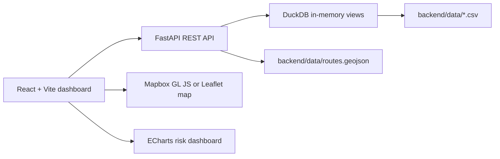
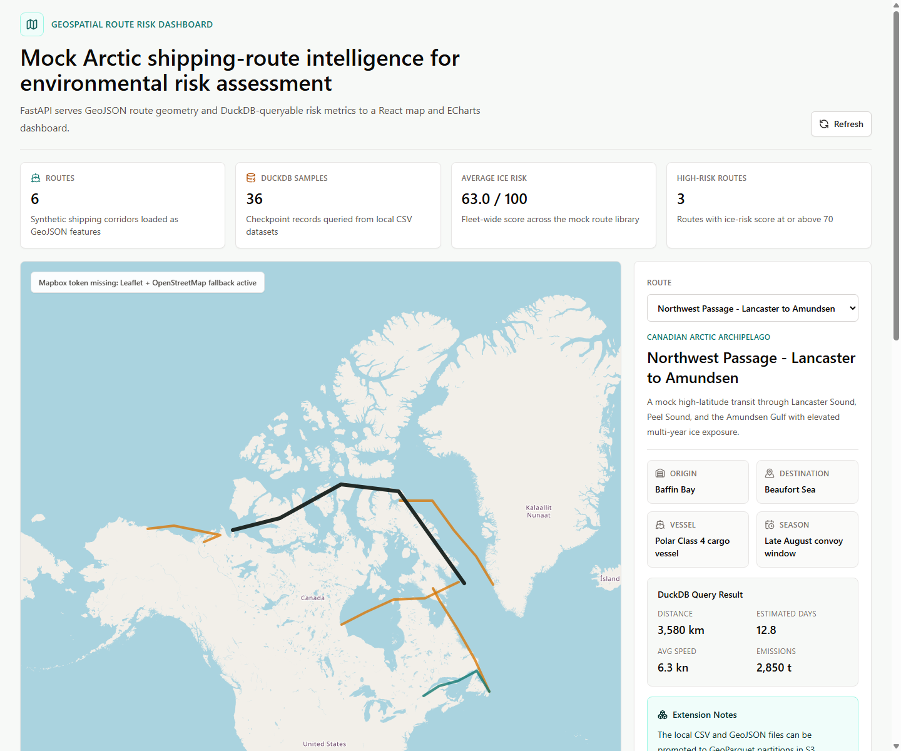

# Geospatial Route Risk Dashboard

An NRC Canada-focused portfolio project that demonstrates geospatial web development, Python backend API design, DuckDB querying, interactive route visualization, and risk-assessment charts using realistic mock shipping-route data.

The dashboard models Arctic and Canadian marine corridors with synthetic GeoJSON route geometry and environmental-risk metrics. It is designed for recruiters and technical reviewers evaluating practical skills in geospatial data products, route analytics, and full-stack dashboard engineering.

## Tech Stack

| Layer | Tools |
| --- | --- |
| Frontend | React, TypeScript, Vite, Tailwind CSS |
| Map | Mapbox GL JS when `VITE_MAPBOX_TOKEN` is set; Leaflet + OpenStreetMap fallback when it is not |
| Charts | Apache ECharts |
| Backend | Python, FastAPI, Pydantic |
| Query Layer | DuckDB over local CSV mock datasets |
| Spatial Data | GeoJSON route features |
| Quality | Pytest, TypeScript build, ESLint |

## Features

- Interactive map showing six mock Canadian Arctic and shipping routes from GeoJSON.
- Route selection by map click or dropdown.
- Details panel with origin, destination, corridor, vessel class, season, and route description.
- DuckDB-backed metrics endpoint for distance, ice-risk score, travel difficulty, ship performance, speed, fuel efficiency, weather exposure, emissions, and checkpoint samples.
- ECharts dashboard with an ice-risk gauge, checkpoint risk profile, operational radar chart, distance accumulation chart, and checkpoint table.
- Loading states and API error messages.
- Clear Mapbox token handling: the app uses Mapbox GL JS only when a token is provided and otherwise runs locally with Leaflet/OpenStreetMap.
- Local mock data under `backend/data`.

## Architecture



The backend validates local data files on startup. Route geometry is loaded from GeoJSON, while risk and performance metrics are queried through DuckDB views over CSV files. The frontend calls the API, renders the route geometry, and updates details and charts whenever the selected route changes.

## API Endpoints

| Method | Endpoint | Description |
| --- | --- | --- |
| GET | `/health` | Reports API status, DuckDB usage, route count, metric count, and checkpoint count |
| GET | `/routes` | Returns a GeoJSON `FeatureCollection` enriched with summary risk metrics |
| GET | `/routes/{id}` | Returns one GeoJSON route feature |
| GET | `/metrics/{id}` | Returns DuckDB-queryable route metrics and checkpoint risk samples |

## Project Structure

```text
backend/
  app/
    database.py      DuckDB views and local data access
    main.py          FastAPI routes
    schemas.py       Pydantic response models
  data/
    routes.geojson
    route_metrics.csv
    risk_samples.csv
  tests/
    test_api.py
frontend/
  src/
    api/client.ts
    components/
    pages/DashboardPage.tsx
    types/
```

## Run Locally

Backend:

```powershell
cd "C:\Users\algha\OneDrive\Documents\New project\geospatial-route-risk-dashboard\backend"
python -m venv .venv
.\.venv\Scripts\Activate.ps1
python -m pip install -r requirements.txt
python -m uvicorn app.main:app --reload
```

Frontend, in a second terminal:

```powershell
cd "C:\Users\algha\OneDrive\Documents\New project\geospatial-route-risk-dashboard\frontend"
npm install
npm run dev
```

Open:

- Frontend: `http://localhost:5173`
- Backend API docs: `http://localhost:8000/docs`
- Health check: `http://localhost:8000/health`

## Environment Variables

Frontend `.env`:

```text
VITE_API_URL=http://localhost:8000
VITE_MAPBOX_TOKEN=
```

`VITE_MAPBOX_TOKEN` is optional. Leave it blank to use the built-in Leaflet/OpenStreetMap fallback.

Backend `.env`:

```text
GEORISK_DATA_DIR=./data
```

`GEORISK_DATA_DIR` is optional and defaults to the repository's `backend/data` folder.

## Docker

```powershell
cd "C:\Users\algha\OneDrive\Documents\New project\geospatial-route-risk-dashboard"
docker compose up --build
```

Open `http://localhost:5173`.

## Testing And Verification

Backend:

```powershell
cd "C:\Users\algha\OneDrive\Documents\New project\geospatial-route-risk-dashboard\backend"
.\.venv\Scripts\Activate.ps1
python -m pytest
```

Frontend:

```powershell
cd "C:\Users\algha\OneDrive\Documents\New project\geospatial-route-risk-dashboard\frontend"
npm run build
```

Manual API smoke checks:

```powershell
Invoke-RestMethod http://127.0.0.1:8000/health
Invoke-RestMethod http://127.0.0.1:8000/routes
Invoke-RestMethod http://127.0.0.1:8000/routes/nwp-lancaster-amundsen
Invoke-RestMethod http://127.0.0.1:8000/metrics/nwp-lancaster-amundsen
```

## Screenshots



## Future Extensions

- Convert the local CSV route metrics into GeoParquet partitioned by region, season, and route class.
- Store route geometry, risk rasters, and vessel telemetry in an AWS S3 data lake.
- Use AWS Lambda to process new environmental-risk snapshots and publish updated route metrics.
- Add DuckDB spatial extensions for geospatial SQL optimization, including route clipping, spatial joins, bounding-box filters, and nearest-hazard queries.
- Add real AIS, sea-ice, weather, and bathymetry feeds behind the same API contract.
